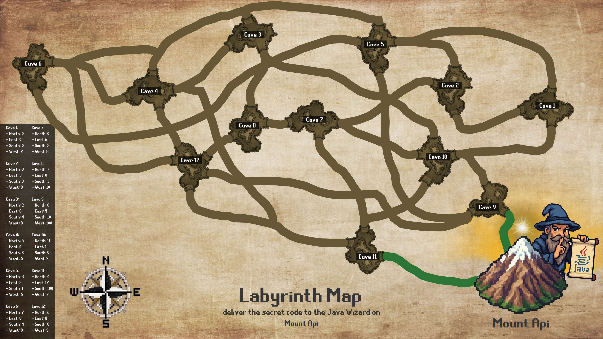

# FELLOWSHIP OF CODE: A JAVA ADVENTURE IN MIDDLE EARTH
## ITO4131 Java Programming | Assessment 2 | TP2
## Nicholas Battle | 35619694 | nbat0021@student.monash.edu

Welcome to the "Fellowship of Code" game, where you lead a fellowship of adventurers through a labyrinth in Middle Earth to deliver a secret code to a Java wizard on Mount Api.

## Youtube Video Demonstration:

- Link: 

## Files Included

- **Source code** (.java files):
  - `FellowshipOfCode.java` - Main class to run the game
  - `Creature.java` - Abstract base class for all creatures
  - `GoodCreature.java` - Abstract class for good creatures (fellowship members)
  - `EvilCreature.java` - Abstract class for evil creatures
  - `Hobbit.java`, `Elf.java`, `Dwarf.java` - Good creature classes
  - `Orc.java`, `Troll.java`, `Goblin.java` - Evil creature classes
  - `Cave.java` - Class representing caves in the labyrinth
  - `GameUtils.java` - Utility class with helper methods
  - `CaveTest.java` - Test class for Cave functionality

- **Data files**:
  - `labyrinth.txt` - Cave structure data
  = `fellowship.txt` - Output file for game summary

- **Documentation**:
  - `ClassDiagram.png`/`.pdf` - UML class diagram
  - `CaveTestStrategy.pdf` - Test cases for the Cave class

## Compiling the Program

To compile all Java files, run the following command in your terminal:

```bash
javac *.java
```

## Running the Program

### Main Game

To start the game, use:

```bash
java FellowshipOfCode
```

Follow the on-screen instructions to:
1. Create your fellowship (naming the hobbit leader and adding elves/dwarves)
2. Navigate through the labyrinth
3. Fight evil creatures and protect the secret code
4. Reach Mount Api with the code to win

### Running the Cave Tests

To run the Cave test class with assertions enabled, use:

```bash
java -ea CaveTest
```

The `-ea` flag enables assertions, which are used to verify the test cases.

## Game Instructions

- Your fellowship is led by a hobbit and can include up to 3 additional elves or dwarves
- Navigate through connected caves in the labyrinth
- When encountering evil creatures, choose which fellowship member will fight
- Hobbits and elves have special weapons that can be used once to instantly win a fight
- Dwarves have higher power but no special weapons
- Creatures die when they accumulate 10 or more damage points
- The game ends when you either:
  - Reach Mount Api with the secret code (success)
  - Lose all fellowship members (failure)

## Quitting the Game

You can type `exit` at any prompt to quit the game.

## Notes

- The game summary will be written to a file called `fellowship.txt` upon completion
- The labyrinth structure is loaded from `labyrinth.txt` and cannot be modified during play
- When all evil creatures are defeated, your fellowship can navigate safely to Mount Api

## Game Map

